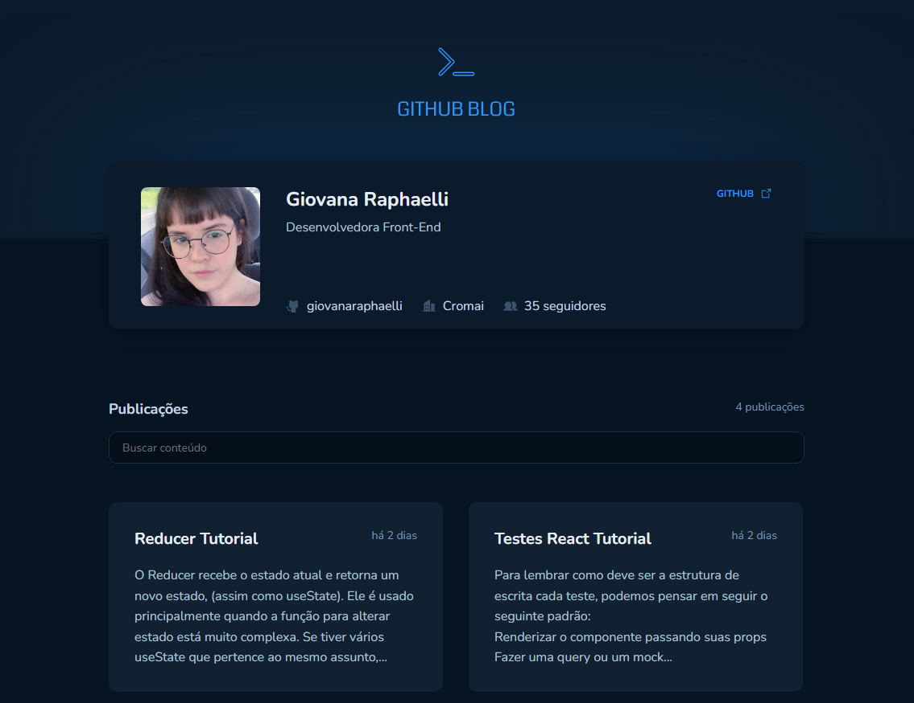

# GitHub Blog Challenge - React

<h4 align="center"><a href="https://github-blog-rocketseat.vercel.app/">Clique para visitar o projeto</a></h4>

## Visão Geral

Este projeto consiste em uma aplicação ReactJS desenvolvida como parte do terceiro desafio da trilha de ReactJS do Ignite. A principal proposta é criar um blog pessoal consumindo a API do GitHub para exibir posts como issues de um repositório.

## Funcionalidades

- **Perfil do Usuário:** Exibe informações do usuário do GitHub, como imagem, número de seguidores, nome, etc.
- **Listagem de Issues:** Apresenta todas as issues do repositório, permitindo filtrar e visualizar um resumo do conteúdo.
- **Página do Post Completo:** Permite a visualização completa de uma issue, formatando o conteúdo escrito em Markdown para HTML.

## Desenvolvimento

Para o desenvolvimento deste projeto, foram utilizadas as seguintes ferramentas e bibliotecas:

- React com Vite e TypeScript
- Axios para realizar requisições HTTP
- React Query para gerenciamento dos estados
- React Router DOM para a criação de rotas dinâmicas
- react-markdown para converter conteúdo Markdown em HTML

## API Github

- [GitHub Users API](https://docs.github.com/pt/rest/users/users#get-a-user): Buscar dados do usuário.
- [GitHub Search API](https://docs.github.com/pt/rest/search): Filtrar issues do repositório.
- [GitHub Issues API](https://docs.github.com/pt/rest/issues/issues#get-an-issue): Exibir o conteúdo completo de uma issue.
